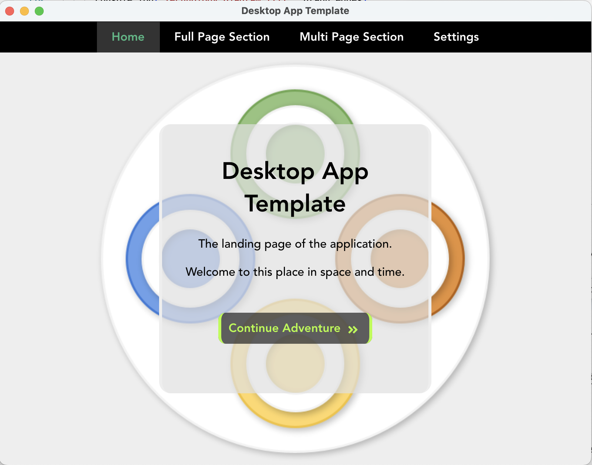
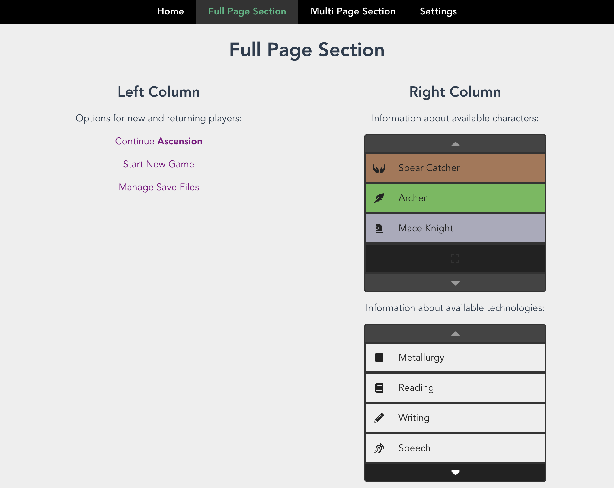
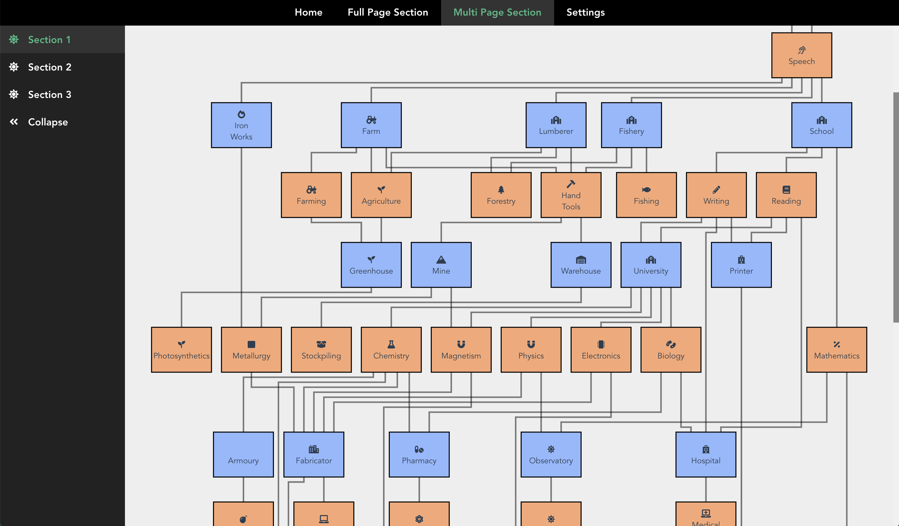

# Desktop App Template

A template for creating a cross-platform application using [Electron JS](https://www.electronjs.org/docs/latest/tutorial/quick-start); using Vue JS to drive the UI and local development flow.

## Preview

### Home page

### Column Layout

### Multi Page Section

## Quick Start for Local Development

Run:
- `npm install`
- `npm start`

This should open up an electron window, running the application using `mainui` hosted from a local server. You should use this when making extensive edits to the user interface - although you may need to do hard restarts to clear any local caching.

## Test Local Distribution

Run:
- `npm run start:predist`

This is an intermediary step that, that will open an electron window, running the application based on a packaged distribution of the `mainui` project, sourced from `mainui/dist`. You should use this to test the application before packaging.

## Packaging

Run: 
- `npm run make`

Produces outputs releasable versions in `out/`.

Find a compatable build based on your local platform, and launch to test.

## Checklist

- [x] Set up this repo
- [x] Template save and load of local files
- [x] Template loading dynamic data sets
- [x] Template basic section navigation
- [x] Template modpack loading
- [x] Add preview screenshots
- [x] Implement build automation, and document commands in README
- [x] Set up basic Electron wrapper
- [x] Set up basic Vue application with Routing
- [x] Build a full page interactive application
- [x] Configure Electron to work with the file based version of the compiled Vue application